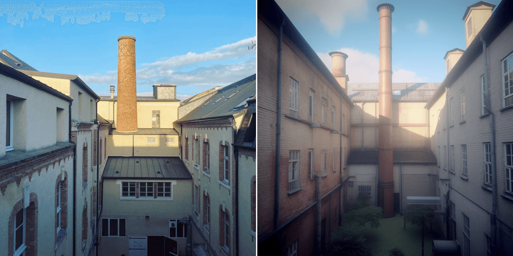
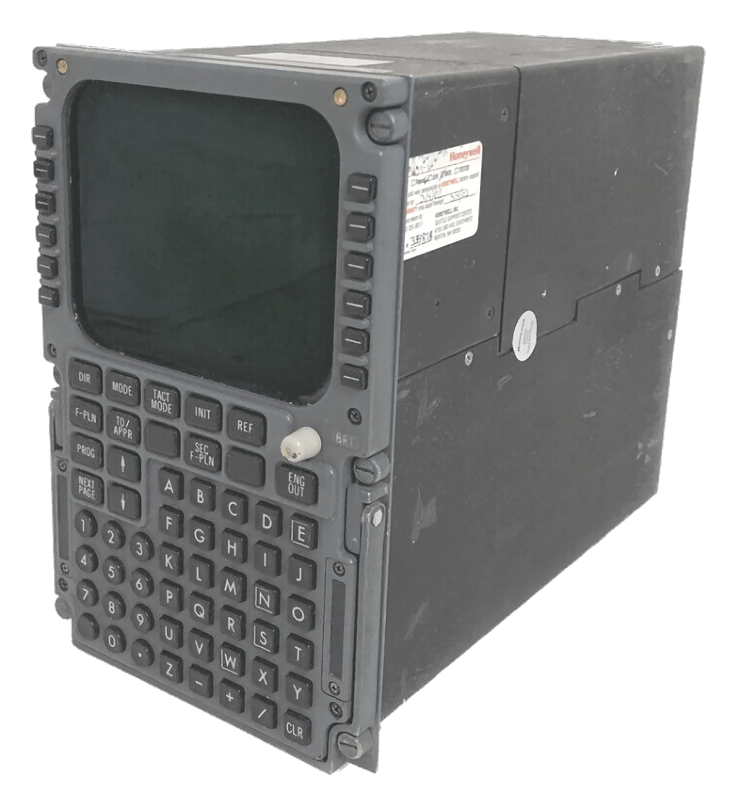
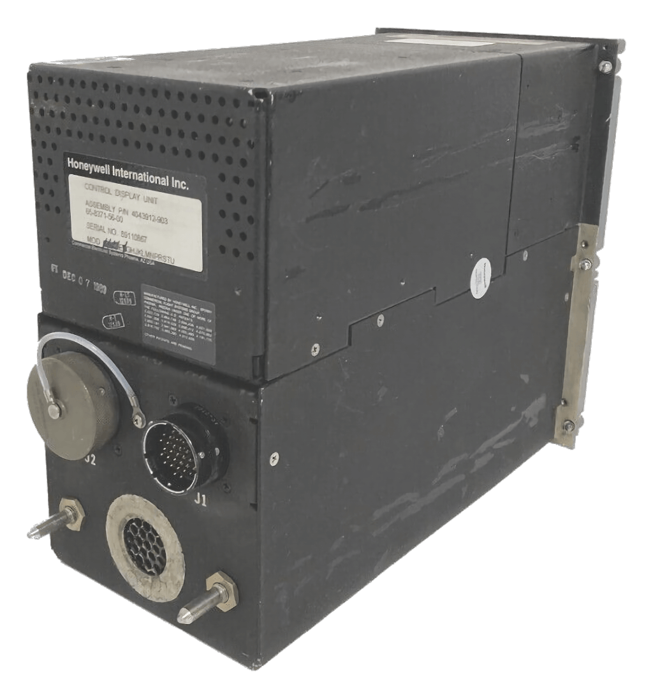
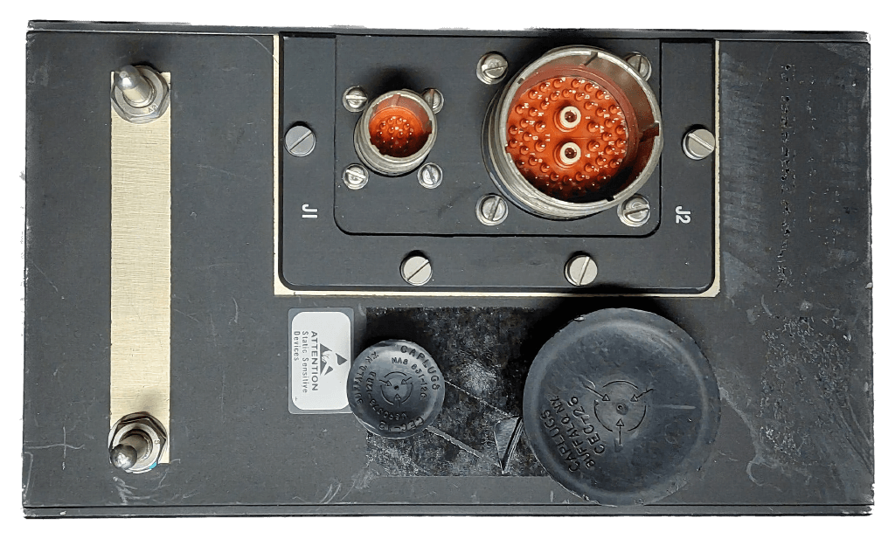

# The Latent Space Navigator

_Une Expérience de Navigation dans le Latent Space_

## Présentation du Projet

Ce projet est une installation interactive qui invite les visiteurs à naviguer dans le "latent space", ou espace latent, grâce à un appareil de navigation faussement analogique basé sur un MCDU (Multipurpose Control Display Unit) d'avion.

L'installation utilise un [MCDU](https://fr.wikipedia.org/wiki/Syst%C3%A8me_de_gestion_de_vol) factice pour afficher et naviguer à travers une collection d'images créées par un réseau antagoniste génératif (GAN). Chaque image représente une transposition générative d'une photographie prise par l'auteur en differents lieux (Orléans, France ou à l'étranger), mêlant les éléments originaux de la photo avec les transformations proposées par l'IA.

## Origine et Idée Maîtresse du Projet

L'idée de ce projet a germé à partir de [l'expérimentation avec une IA générative d'images](https://labomedia.org/oeuvres-interactives/un-cabinet-de-curiosites-numeriques/) (un GAN, ou réseau antagoniste génératif) pour créer des versions transformées d'une photographie de la cour du ["108" à Orléans](https://le108.org/). En fournissant lui une photo originale, l'IA a proposé différentes transpositions en texte et en images. Ces transpositions ont été mélangées avec la photo originale pour créer une image à la fois très proche et très différente de l'original. Cette experimentation a été poursuivie par l'auteur, sur un grand nombre de photographies et de sujets divers.

 
_L'autre 108, image réelle et synthétique du 108/Labomedia_

Le résultat est [une collection d'images allant par paires](https://www.instagram.com/latentspacecadet/): l'original et la version synthétique. Chaque image synthétique représente une réalité alternative possible, rendant manifeste l'idée du _latent space_ (espace latent), un espace abstrait multidimensionnel qui est l'incubateur de toutes les réalités possibles qu'une IA générative peut créer.

L'idée maîtresse du projet est ainsi de donner une forme concrète à cette idée d'un voyage dans le latent space. L'installation invite les visiteurs à naviguer à travers cette réalité différente, à la manière d'un voyageur qui navigue à travers un espace géographique. 

Pour cela, l'installation utilise un appareil de navigation factice, basé sur un MCDU (Multipurpose Control Display Unit) d'avion. Cet appareil est un outil de navigation couramment utilisé dans l'aviation pour entrer et afficher les informations de vol. En le détournant de son usage original, l'installation fait écho au processus de transformation des images par l'IA, et renforce le lien métaphorique entre la navigation géographique et la navigation dans le _latent space_.

## Composants de l'Installation

L'installation est composée des éléments suivants :

1. Un MCDU factice, comprenant :
   - un boîtier (peut-être en bois peint),
   - une façade imprimée en 3D, inspirée d'un MCDU Honeywell,
   - un écran et un clavier récupérés.
2. Un mini-ordinateur (par exemple un Raspberry Pi) à l'intérieur du MCDU, fonctionnant sous Linux.
3. Un vidéoprojecteur relié à l'ordinateur pour afficher les images sur un mur.

## Interaction avec l'Installation

Les visiteurs interagissent avec l'installation en entrant des coordonnées sur le clavier du MCDU. Chaque ensemble de coordonnées correspond à une image spécifique de la collection. L'image est ensuite affichée sur le mur à l'aide du vidéoprojecteur.

Un "mode autopilote" est également disponible, qui fait défiler automatiquement les images lorsqu'aucune interaction n'a lieu.

## Travail du Son

L'expérience est accompagnée par des bruitages analogiques, notamment des bruits mécanographiques lors de l'interaction avec le clavier. D'autres sons peuvent inclure des bruits de navigation, des sons d'ambiance de l'espace, de la musique générative, ou des réactions sonores spécifiques pour chaque image affichée.

## Equipements possibles

### MCDU

- https://a320fcu.com/en/product/mcdu-airbus-a320-on-table/

### Ecran

- *Waveshare 7 inch Display for Raspberry Pi :* Écran tactile capacitif HDMI LCD (H) 1024x600 Resolution IPS Monitor Supports All Raspberry Pi/Jetson.
- *7inch HDMI LCD Display (C) - Amazon :* Écran tactile capacitif de 7 pouces, interface HDMI, prend en charge divers systèmes.
- *7 Inch Lcd Monitor With Hdmi Input - Computer And Office - AliExpress :* Écran LCD de 7 pouces avec entrée HDMI.
- *7 inch Lilliput portable HDMI monitors for DSLR, computer and field work :* Le Lilliput 619AT est un moniteur de terrain LCD 16:9 de 7 pouces avec une entrée HDMI et un écran tactile intégré.
- *8 Inch Mini HDMI Portable LCD Display 1280x800 Resolution Monitor Buil - Pi Australia :* Ce petit moniteur améliore avec des haut-parleurs intégrés. Le volume/la luminosité peut être ajusté.

### Clavier

- https://www.minimachines.net/actu/orthopi-95187

### ECU

- _Gigabyte B450 I Aorus Pro :_ Une carte mère ITX intégrée graphique abordable mais puissante.
- _Asus ROG Strix B760-I Gaming WiFi :_ Construction de petite taille et souhaitez un bon équilibre de fonctionnalités pour le prix.
- _Intel® Celeron Baytrail SoC Processor :_ Processeur SoC Intel® Celeron Baytrail ; Graphiques Intel® Gen7 Intel intégrés DX 10 ; Prend en charge la DDR3L 1333MHz en double canal, 2 x SO-DIMM, jusqu'à 16GB de système.

## Images

